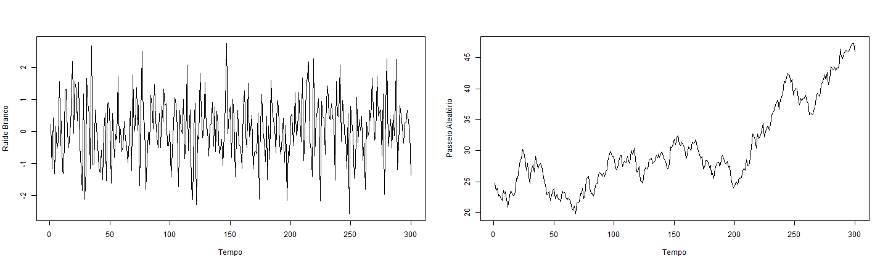
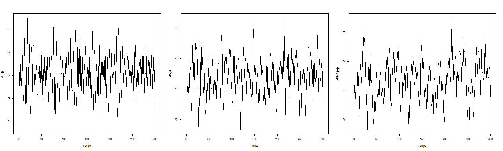
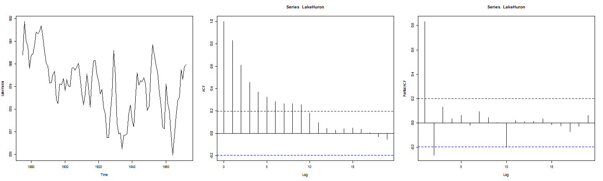
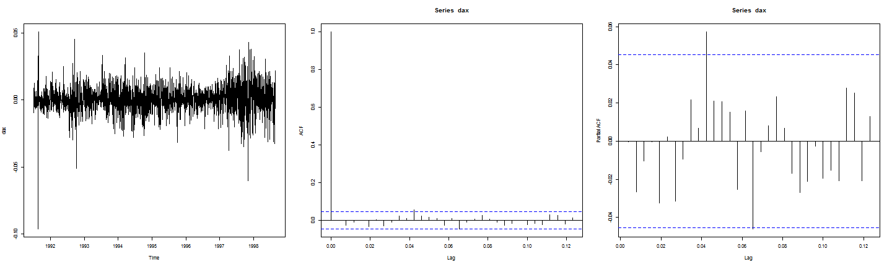
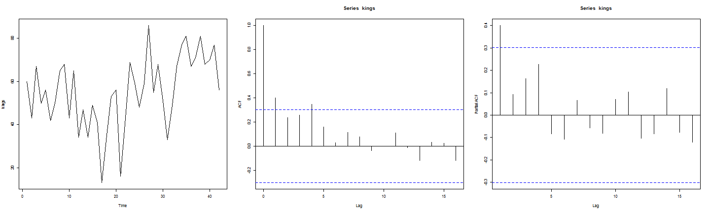
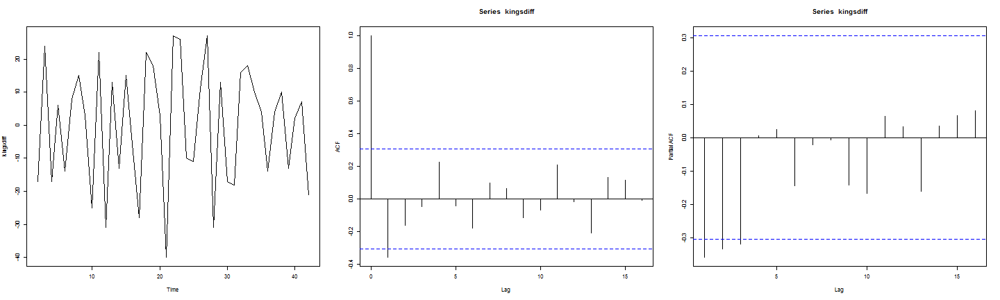
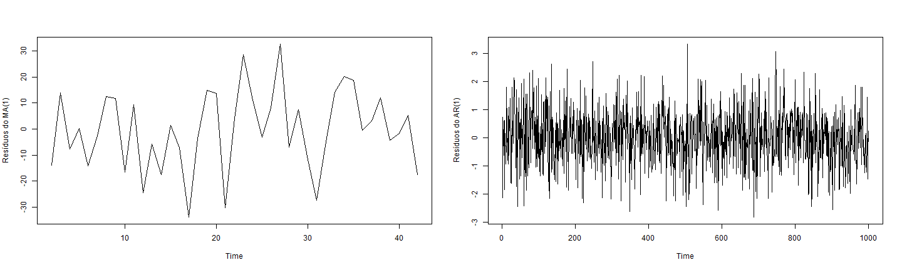
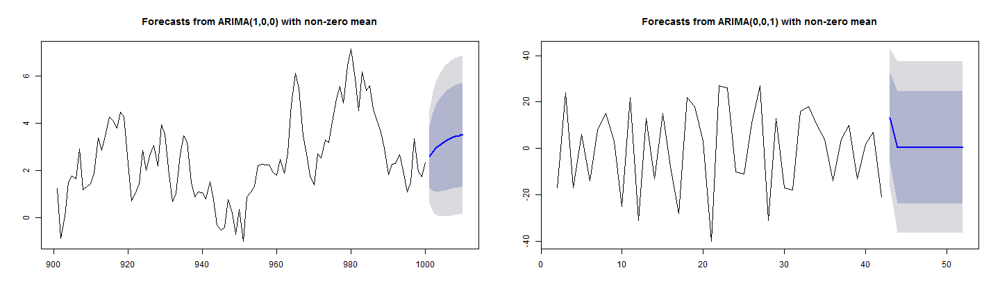

Modelos ARIMA no R
===============================

Regis Augusto Ely

Departamento de Economia

Universidade Federal de Pelotas

Maio de 2014 - Primeira versão
------------------------------


Neste exercício iremos ver alguns exemplos de implementação dos modelos ARIMA que estudamos em aula. A lógica é reconstruir a dinâmica por trás dos modelos e entender melhor os resultados teóricos que vimos durante o curso de séries temporais no PPGOM/UFPel. Por isso vamos simular e estimar os modelos na "mão", sem utilizar funções prontas do R. Já para a realização do diagnóstico e previsão iremos utilizar alguns funções que nos facilitam o cálculo.

## Simulação

Vamos simular alguns modelos ARMA no R. Para isso, primeiro devemos definir os parâmetros desejados. Você pode alterar ou incluir os coeficientes da maneira que quiseres.


```r
# Definição dos parâmetros
n <- 400  # Total de observações simuladas
nx <- 100  # Total de observações descartadas
c <- 0.3  # Constante do AR
phi <- c(0.5, -0.8)  # Vetor de parâmetros do AR
mu <- 0.7  # Média do MA
theta <- c(0.8, 0.3, -0.2)  # Vetor de parâmetros do MA
ca <- 0.2  # Constante do ARMA
phia <- c(0.6)  # Vetor de parâmetros AR do ARMA
thetaa <- c(0.3)  # Vetor de parâmetros MA do ARMA
```


Agora vamos criar os vetores para armazenarmos os dados e o ruído branco que será o componente aletório dos modelos, além de calcular as ordens p e q dos processos.


```r
# Criação dos vetores e cálculo dos valores de p, d e q.
set.seed(12345)
rb <- rnorm(n)  # Ruído branco
yar <- numeric(n)  # Vetor do AR
yma <- numeric(n)  # Vetor do MA
yarma <- numeric(n)  # Vetor do ARMA
p <- length(phi)  # Ordem do AR
q <- length(theta)  # Ordem do MA
pa <- length(phia)  # Ordem AR do ARMA
qa <- length(thetaa)  # Ordem MA do ARMA
```


Iremos agora gerar n observações das séries, descartando as nx primeiras. Primeiro vamos simular um ruído branco e um passeio aleatório. Os gráficos são plotados no final do comando.


```r
# Simulação do ruído branco e do passeio aleatório
ruido <- rb[-1:-nx]  # Ruído Branco
rw <- cumsum(rb)
passeio <- rw[-1:-nx]  # Passeio aleatório
par(mfrow = c(1, 2))
ts.plot(ruido, gpars = list(xlab = "Tempo", ylab = "Ruído Branco"))
ts.plot(passeio, gpars = list(xlab = "Tempo", ylab = "Passeio Aleatório"))
```

 


Agora vamos simular os processos AR, MA e ARMA. O objetivo aqui é construir os processos através de sua estrutura recursiva, sem utilizar nenhuma função específica do R para isso. Os valores e a quantidade de parâmetros dos modelos são definidos acima no primeiro bloco de código. No final, plotamos os gráficos destes processos.


```r
### Simulação do processo AR(p)
for (i in (p + 1):n) {
    psum <- 0
    for (j in 1:p) {
        psum <- psum + phi[j] * yar[i - j]
    }
    yar[i] <- psum + c + rb[i]
}
ar <- yar[-1:-nx]

### Simulação do processo MA(q)
for (i in (q + 1):n) {
    psum <- 0
    for (k in 1:q) {
        psum <- psum + theta[k] * rb[i - k]
    }
    yma[i] <- psum + mu + rb[i]
}
ma <- yma[-1:-nx]

### Simulação do processo ARMA(p,q)
for (i in (pa + 1):n) {
    psum <- 0
    for (j in 1:pa) {
        psum <- psum + phia[j] * yarma[i - j]
    }
    for (k in 1:qa) {
        psum <- psum + thetaa[k] * rb[i - k]
    }
    yarma[i] <- psum + ca + rb[i]
}
arma <- yarma[-1:-nx]

# Plotando os resultados
par(mfrow = c(1, 3))
ts.plot(ar, gpars = list(xlab = "Tempo", ylab = "AR(p)"))
ts.plot(ma, gpars = list(xlab = "Tempo", ylab = "MA(q)"))
ts.plot(arma, gpars = list(xlab = "Tempo", ylab = "ARMA(p,q)"))
```

 


Note que estas séries parecem apresentar uma persistência maior dos choques do que a série do ruído branco. É esta persistência que podemos modelar.

Podemos gravar os dados gerados em um arquivo .csv se quisermos


```r
# Gravar dados no arquivo 'simulations.csv'
export <- cbind(ruido, passeio, ar, ma, arma)
write.csv(export, file = "simulations.csv")
```


## Identificação

Vamos carregar alguns dados reais para identificarmos qual modelo ARMA melhor se encaixa. Iremos observar uma série dos níveis do [lago Huron](http://en.wikipedia.org/wiki/Lake_Huron) durante os anos de 1875-1972. Para identificarmos o melhor modelo para esta série devemos olhar para a função de autocorrelação e a função de autocorrelação parcial.


```r
data(LakeHuron)
par(mfrow = c(1, 3))
plot(LakeHuron)
acf(LakeHuron)
pacf(LakeHuron)
```

 


Repare que a fac parece decair exponencialmente até se tornar estatisticamente insignificante. Já a facp tem dois picos no lag 1 e 2. Pela metodologia de Box-Jenkins, isso nos indica que o melhor para estimar a autocorrelação desta série é um processo AR(2).

Agora vamos analisar uma série do valor diário de fechamento do índice de ações [DAX](http://en.wikipedia.org/wiki/DAX) durante 1991 a 1998, que é composto pelas 30 maiores companhias alemãs da Bolsa de valores de Frankfurt.


```r
data(EuStockMarkets)
par(mfrow = c(1, 2))
plot(EuStockMarkets[, 1])
acf(EuStockMarkets[, 1])
```

 


Observe que este índice tem um comportamento bem errático, que lembra o passeio aleatório que simulamos anteriormente. A fac não decai exponencialmente, sinalizando que a série não parece ser estacionária.

Vamos agora tirar a primeira diferença desta série, mas antes aplicamos o log, pois então ganhamos a interpretação de retorno continuamente composto, além de estabilizar um pouco a variância e transformar possíveis tendências exponenciais em lineares.


```r
dax <- diff(log(EuStockMarkets[, 1]))
par(mfrow = c(1, 3))
plot(dax)
acf(dax)
pacf(dax)
```

 


Agora temos uma série com o comportamento de um ruído branco. Parece que não há nenhuma correlação entre retornos passados e presentes. Bem eficiente este mercado alemão hein! Parece que nossos modelos ARIMA não são suficientes para extrair alguma informação dos alemães. Mais tarde veremos alguns modelos não lineares que nos dizem algo sobre esses agrupamentos de volatilidade que vemos no primeiro gráfico acima.

Vamos analisar uma última série temporal da idade da morte de 42 reis sucessivos da Inglaterra. Obteremos estes dados pela internet (uma conexão é necessária). Os dados estão no site do [Rob J Hyndman](http://robjhyndman.com/), que é professor de estatística da Monash University na Austrália. Ele também é autor do pacote forecast no R, que utilizaremos mais a frente. Em seu site há muito material sobre séries e sobre o R, principalmente no tópico de previsão, sua especialidade.


```r
kings <- ts(scan("http://robjhyndman.com/tsdldata/misc/kings.dat", skip = 3))
par(mfrow = c(1, 3))
plot(kings)
acf(kings)
pacf(kings)
```

 


Repare que apesar de parecer estar tudo ok com a fac e facp, a média da série claramente mudou longo do tempo. Isso é um indicativo de não estacionariedade. Aqui iremos avançar um pouco no conteúdo e introduzir o teste de Dickey-Fuller aumentado para verificar essa nossa hipótese de não estacionariedade. Para isso precisaremos instalar um pacote novo no R, chamado [tseries](http://cran.r-project.org/web/packages/tseries/index.html), que contém a função adf.test.


```r
if (!require(tseries)) {
    install.packages("tseries", repos = "http://cran.rstudio.com/")
}
library(tseries)
adf.test(kings)
```

```
## 
## 	Augmented Dickey-Fuller Test
## 
## data:  kings
## Dickey-Fuller = -2.113, Lag order = 3, p-value = 0.529
## alternative hypothesis: stationary
```


Aceitamos a hipótese de uma raíz unitária, o que nos diz que a série não é estacionária (veremos o teste ADF com cuidado mais a frente). Vamos então tirar a primeira diferença e ver o que acontece.


```r
kingsdiff <- diff(kings, 1)
adf.test(kingsdiff)
```

```
## 
## 	Augmented Dickey-Fuller Test
## 
## data:  kingsdiff
## Dickey-Fuller = -4.075, Lag order = 3, p-value = 0.01654
## alternative hypothesis: stationary
```


Agora sim. Rejeitamos a hipótese nula e parece que a série é estacionária. Vamos olhar para os gráficos.


```r
par(mfrow = c(1, 3))
plot(kingsdiff)
acf(kingsdiff)
pacf(kingsdiff)
```

 


Esta série está um pouco complicada. Temos algumas possibilidades diferentes. Poderia ser um AR(3) ou um MA(1). Vamos com o MA(1) por ser mais parcimônio (menos coeficientes).

Agora que aprendemos a dinâmica dos modelos ARIMA e identificamos nossas séries, vamos aprender a estimar os modelos.

## Estimação

Aqui o objetivo é construir a estimativa de máxima verossimilhança conforme vimos em aula. Para isso teremos que criar uma função para calcular a log-verossimilhança e então carregá-la dentro da função [optim](http://stat.ethz.ch/R-manual/R-devel/library/stats/html/optim.html) do R, que utiliza métodos de otimização numérica para achar o valor dos parâmetros que minimiza o negativa da função. Podemos então comparar os nossos resultados com a funçao [arima](http://stat.ethz.ch/R-manual/R-devel/library/stats/html/arima.html) do R, que estima tudo isso automaticamente.

Professor, mas se a função arima já faz automaticamente, para que construir a log-verossimilhança? Para aprender! O dia que você quiser estimar um modelo recente, que não haja pacote pronto no R, ou até um modelo que você desenvolveu, então você irá lembrar desse exercício.

Vamos lá! Primeiro iremos estimar o MA(1) que identificamos na série da idade da morte de reis da Inglaterra. A primeira etapa é carregar uma função que nos dê a log-verossimilhança de um MA(1) para um conjunto de dados e parâmetros. Utilizaremos a função de log-verossimilhança condicional, conforme vimos em aula:

$$L(\theta; Y_t) = - \frac{T}{2} \ln(2 \pi) - \frac{T}{2} \ln(\sigma^2) - \sum_{t=1}^T \frac{\varepsilon_t^2}{2 \sigma^2}$$

E lembrem que $\varepsilon_t = y_t - \mu - \theta \varepsilon_{t-1}$ no caso de um MA(1). Iremos também supor que $\varepsilon_0 = 0$. Então vamos construir essa função.


```r
loglik.ma <- function(param, data) {
    T <- length(data)
    res <- numeric(T)
    res[1] <- data[1] - param[1]
    c1 <- -(T/2) * log(2 * pi)
    for (i in 2:T) {
        res[i] <- data[i] - param[1] - param[2] * res[i - 1]
    }
    c2 <- -(T/2) * log(param[3])
    c3 <- -sum((res^2)/(2 * param[3]))
    L <- c1 + c2 + c3
    -L
}
```


Agora vamos chutar parâmetros iniciais e então mandar a função optim encontrar os parâmetros que minimizam essa funçao acima. Note que os nossos parâmetros são $(\mu, \theta, \sigma^2)$. A função irá retornar alguns warnings pelo fato de tentar valores negativos para $\sigma^2$, mas por enquanto isso não é problema para nós. Também podemos calcular os erros dos coeficientes pegando os elementos da diagonal da raíz quadrada da matriz inversa da hessiana. Comparamos os resultados com a função arima do R.


```r
# Dando um chute inicial e estimando o MA(1)
param_ma <- c(0.5, 0.1, 10)
estma <- optim(par = param_ma, fn = loglik.ma, method = "BFGS", hessian = TRUE, data = kingsdiff)

# Calculando o erro padrão dos coeficiente
estma_se <- sqrt(diag(solve(estma$hessian)))

# Estimando pela função arima e comparando os resultados numa matriz
estma_arima <- arima(kingsdiff, order = c(0,0,1))
result_ma <- matrix(c(estma_arima$coef[2:1], estma_arima$sigma2, sqrt(diag(estma_arima$var.coef))[2:1], NA), 2, 3, byrow=TRUE)
ma_comp <- rbind(estma$par, result_ma[1,], estma_se, result_ma[2,])
colnames(ma_comp) <- c("mu", "theta", "sigma2")
rownames(ma_comp) <- c("optim.coef", "arima.coef", "optim.se", "arima.se")
ma_comp
```

```
##                mu   theta sigma2
## optim.coef 0.3292 -0.7417 209.95
## arima.coef 0.3882 -0.7463 228.24
## optim.se   0.6199  0.1105  42.35
## arima.se   0.6522  0.1278     NA
```


Os resultados são parecidos não? Alguma diferença existe, pois o método da função arima utiliza como chutes iniciais a estimativa de minímos quadráticos (que é um chute inicial melhor do que o nosso). Note que a função arima não calcula a variância do erro, por isso o NA no último elemento.

Agora vamos estimar um modelo AR(1) utilizando a expressão da log-verossimilhança que vimos na aula:

$$ L(\phi, Y_t) = - \left[ \frac{T-1}{2} \right] \ln(2 \pi) - \left[ \frac{T-1}{2} \right] \ln(\sigma^2) - \sum_{t=2}^T \frac{\varepsilon_t^2}{2 \sigma^2} $$

Lembrando que agora $\varepsilon_t = y_t - c - \phi y_{t-1}$. Vamos utilizar a série . Seguiremos as mesmas etapas, primeiro carregando a função de log-verossimilhança. Note que teremos de novo 3 parâmetros $(c, \phi, \sigma^2)$, e iremos supor que $y_0 = 0$.


```r
loglik.ar <- function(param, data) {
    T <- length(data)
    res <- numeric(T)
    res[1] <- data[1] - param[1]
    c1 <- -((T - 1)/2) * log(2 * pi)
    for (i in 2:T) {
        res[i] <- data[i] - param[1] - param[2] * data[i - 1]
    }
    c2 <- -((T - 1)/2) * log(param[3])
    c3 <- -sum((res^2)/(2 * param[3]))
    L <- c1 + c2 + c3
    -L
}
```


Para realizar a estimação, iremos gerar uma série AR(1) com valores $c = 0.7$, $\phi = 0.8$ e $\sigma^2 = 1$. Então comparamos os resultados com a função arima do R.


```r
# Criando um AR(1)
set.seed(12345)
yt <- numeric(1000)
eps <- rnorm(1000)
c <- 0.7
phi <- 0.8
for (i in 2:1000) {
    yt[i] <- c + phi * yt[i - 1] + eps[i]
}

# Dando um chute inicial e estimando o AR(1)
param_ar <- c(1, 0.5, 0.5)
estar <- optim(par = param_ar, fn = loglik.ar, method = "BFGS", hessian = TRUE, 
    data = yt)

# Calculando o erro padrão dos coeficiente
estar_se <- sqrt(diag(solve(estar$hessian)))

# Estimando pela função arima e comparando os resultados numa matriz
estar_arima <- arima(yt, order = c(1, 0, 0))
result_ar <- matrix(c(estar_arima$coef[2:1], estar_arima$sigma2, sqrt(diag(estar_arima$var.coef))[2:1], 
    NA), 2, 3, byrow = TRUE)
ar_comp <- rbind(estar$par, result_ar[1, ], estar_se, result_ar[2, ])
colnames(ar_comp) <- c("c", "phi", "sigma2")
rownames(ar_comp) <- c("optim.coef", "arima.coef", "optim.se", "arima.se")
ar_comp
```

```
##                  c     phi  sigma2
## optim.coef 0.70172 0.81163 0.99735
## arima.coef 3.69315 0.81376 1.00055
## optim.se   0.07517 0.01837 0.04462
## arima.se   0.16912 0.01843      NA
```


Os resultados são semelhantes, com exceção do coeficiente c. Isso porque a função arima calcula o intercepto como sendo $\mu$ e não c. Mas lembre que $\mu = \frac{c}{1-\phi}$. Assim, podemos calcular o c do modelo estimado pela função arima e comparar com o nosso.


```r
ar_comp[2, 1] * (1 - ar_comp[2, 2])
```

```
## [1] 0.6878
```


Agora sim, o resultado está próximo. Está na hora de vermos se a nossa estimação está boa, ou seja, se estamos conseguindo remover completamente a correlação dos resíduos.

## Diagnóstico

Para verificarmos se o modelo está bem especificado, devemos olhar para os resíduos da estimação.


```r
par(mfrow = c(1, 2))
plot(estma_arima$residuals, ylab = "Resíduos do MA(1)")
plot(estar_arima$residuals, ylab = "Resíduos do AR(1)")
```

 


Parecem estacionários, mas para sabermos se eliminamos completamente a autocorrelação residual devemos fazer o teste de Ljung-Box.


```r
Box.test(estma_arima$residuals, lag = 15, type = "Ljung-Box")
```

```
## 
## 	Box-Ljung test
## 
## data:  estma_arima$residuals
## X-squared = 10.14, df = 15, p-value = 0.8107
```

```r
Box.test(estar_arima$residuals, lag = 15, type = "Ljung-Box")
```

```
## 
## 	Box-Ljung test
## 
## data:  estar_arima$residuals
## X-squared = 15.6, df = 15, p-value = 0.4092
```


Ok, aceitamos a hipótese nula de que os resíduos não são autocorrelacionados. Agora temos um bom modelo linear para descrever nossos dados. Vamos realizar alguma previsão para estas variáveis.

## Previsão

O melhor pacote de previsão do R é o [forecast](http://cran.r-project.org/web/packages/forecast/index.html). Irei carregar ele e então realizar uma previsão de 10 horizonte para o MA e o AR. Este pacote utiliza uma função interna para a estimação chamada Arima. Antes de fazer a previsão vamos estimar os modelos de novo através dessa função.


```r
if (!require(forecast)) {
    install.packages("forecast", repos = "http://cran.rstudio.com/")
}
library(forecast)
Ma <- Arima(kingsdiff, order = c(0, 0, 1))
Ar <- Arima(yt, order = c(1, 0, 0))

prev_ma <- forecast.Arima(Ma, h = 10)
prev_ma
```

```
##    Point Forecast   Lo 80 Hi 80  Lo 95 Hi 95
## 43        13.3630  -5.998 32.72 -16.25 42.97
## 44         0.3882 -23.770 24.55 -36.56 37.34
## 45         0.3882 -23.770 24.55 -36.56 37.34
## 46         0.3882 -23.770 24.55 -36.56 37.34
## 47         0.3882 -23.770 24.55 -36.56 37.34
## 48         0.3882 -23.770 24.55 -36.56 37.34
## 49         0.3882 -23.770 24.55 -36.56 37.34
## 50         0.3882 -23.770 24.55 -36.56 37.34
## 51         0.3882 -23.770 24.55 -36.56 37.34
## 52         0.3882 -23.770 24.55 -36.56 37.34
```

```r
prev_ar <- forecast.Arima(Ar, h = 10)
prev_ar
```

```
##      Point Forecast Lo 80 Hi 80   Lo 95 Hi 95
## 1001          2.589 1.307 3.871 0.62866 4.550
## 1002          2.795 1.142 4.447 0.26718 5.322
## 1003          2.962 1.104 4.820 0.12058 5.804
## 1004          3.098 1.116 5.080 0.06670 6.130
## 1005          3.209 1.149 5.269 0.05796 6.360
## 1006          3.299 1.189 5.410 0.07140 6.527
## 1007          3.373 1.229 5.516 0.09495 6.650
## 1008          3.432 1.268 5.597 0.12208 6.742
## 1009          3.481 1.302 5.659 0.14927 6.812
## 1010          3.520 1.333 5.708 0.17471 6.866
```

```r

par(mfrow = c(1, 2))
plot(prev_ar, include = 100)
plot(prev_ma, include = 100)
```

 


Note que no MA(1), a previsão converge para a média após o primeiro período, enquanto que no AR, a previsão irá lentamente convergir para a média. Exatamente como vimos em aula quando calculamos isso! :)
